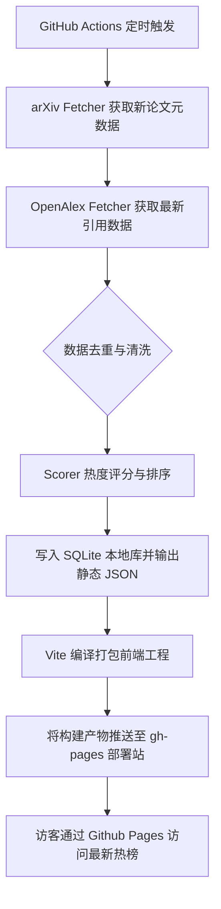

# AI 学术热度追踪平台 - 核心业务流程

> 通过结构化文字或流程图(Mermaid)描述系统运转的核心主干。

## 1. 主干业务流程概述
- **流程名称**：每日定时论文数据抓取与前端页面发布流程。
- **参与角色**：GitHub Actions（定时触发器）、Python 后端清洗程序、第三方 API（arXiv, OpenAlex）、静态网页访客。

## 2. 核心状态流转 (正常路径)
1. **定时触发**：每天世界标准时间 (UTC) 06:00，GitHub Actions 自动启动任务流。
2. **数据抓取**：爬虫模块向 arXiv 查询过去规定天数（如 7-14 天）的 AI 分类论文。
3. **数据丰富与打分**：
   - 使用 OpenAlex API 为所获取的论文补充最新的引文数据。
   - Scoring 模块结合时间、增量、总量进行 Min-Max 加权打分，得出最终热度排名。
4. **持久化与导出**：
   - 将经过计算的 Paper 列表存储入 SQLite 本地数据库去重/存档。
   - 生成对应的 `latest.json` 和日期相关静态 JSON 文件供前端使用。
5. **打包部署**：Actions 执行 Vite 的生产环境打包，将页面和生成的 JSON 数据直接推送到 `gh-pages` 分支，完成发布。

## 3. 逆向与异常流程 (异常分支)
- **异常场景 A**：第三方 API（如 OpenAlex）限流或超时。
  - **处理方案**：针对限流使用重试机制 + 后退补偿（Exponential Backoff）。若最终失败，则继承前一天的引用量缓存或按 0 处理，确保系统不致于完全崩溃崩溃停摆。
- **异常场景 B**：获取到的论文解析异常（缺少关键字段）。
  - **处理方案**：在解析处增加强校验，关键字段丢失（如 title/authors）则直接予以丢弃，不污染终端榜单。

## 4. 流程图预留区 (Mermaid)

