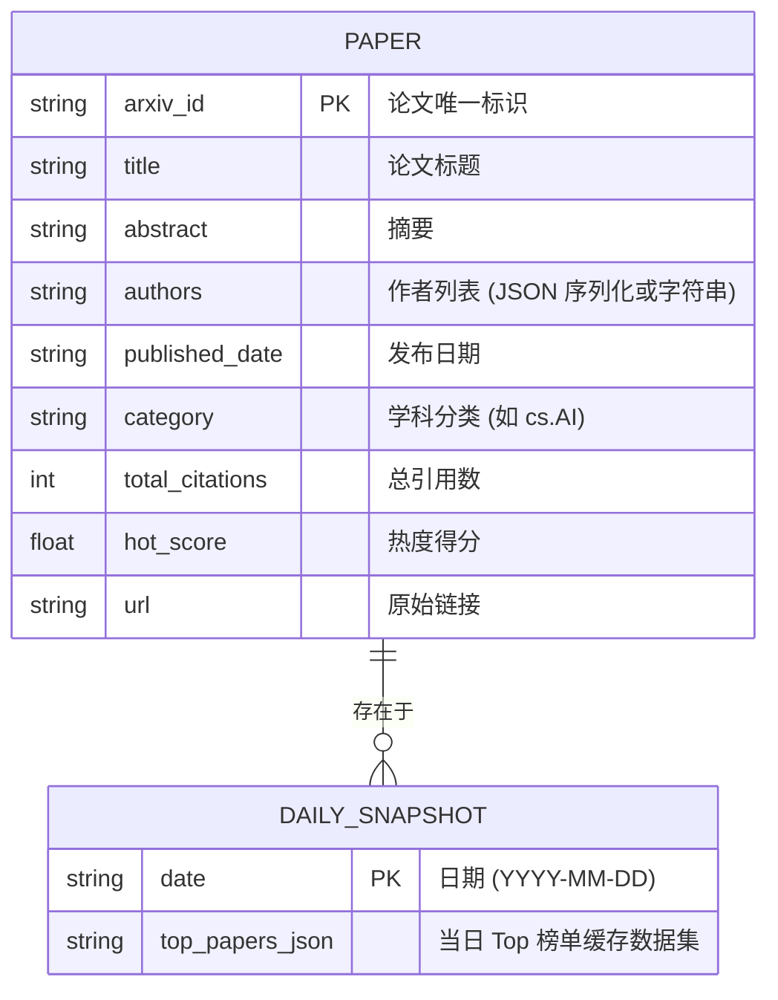

# AI 学术热度追踪平台 - 数据模型与业务对象定义

> 用于描述系统底层管理的核心实体 (Entity)，是数据库设计和接口设计的根基。

## 1. 全局实体关系 (ERD)

## 2. 核心实体详细定义

### 实体：Paper / 论文
- **业务定义**：代表从 arXiv 等源头获取到的一篇独立学术论文。
- **生命周期**：发现提取 -> 补充引文数据 -> 参与打分排名 -> 持久化存储 / 展示。
- **核心属性/字段**：
  - `arxiv_id` (主键)：从源头继承的唯一 ID。
  - `title`：论文名称。
  - `abstract`：摘要。对需要降低语言门槛的用户而言，日后这一字段可能将接入大模型进行“简明总结”。
  - `hot_score`：动态发生变化的评分字段，每日更新。

### 实体：Snapshot / 每日快照
- **业务定义**：因为系统采取每天定时预先渲染并导出 JSON 给纯静态前端消费的方式，所以引入快照概念，记录每日榜单快照。
- **生命周期**：生成 -> 存档 -> 供历史查询。

## 3. 核心实体的状态机 (State Machine)
由于系统主要流转是自动化 ETL（Extract, Transform, Load），针对单篇论文的状态较为简单：
- `FETCHED`（已获取初版） -> `ENRICHED`（已补充外部引用等数据） -> `SCORED`（已完成打分测算） -> `EXPORTED`（已进入静态发布池）。
