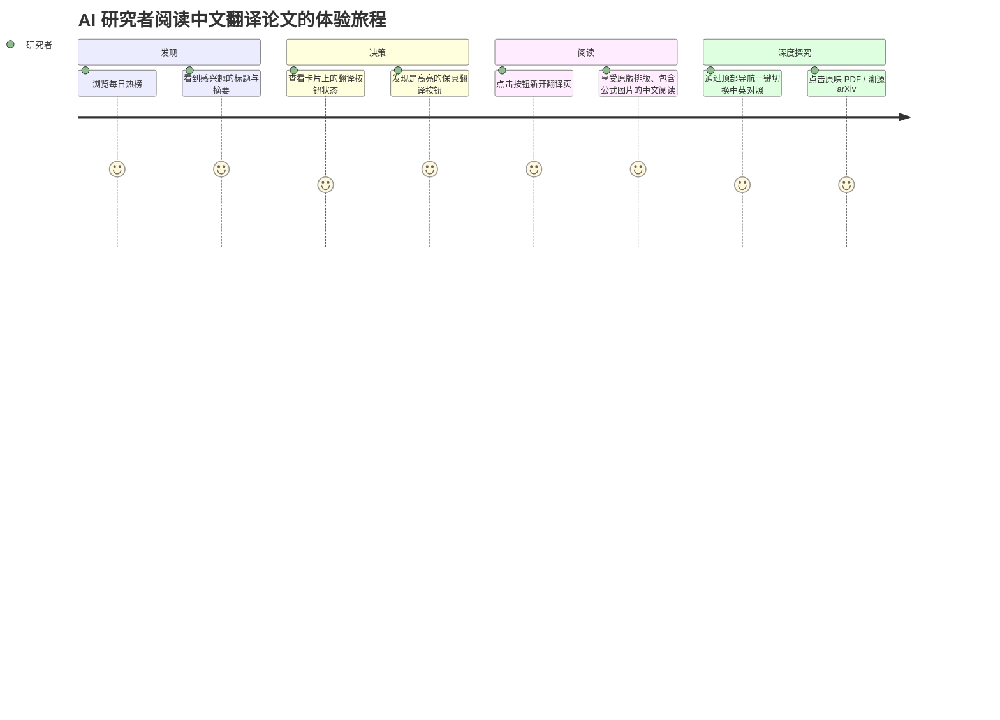
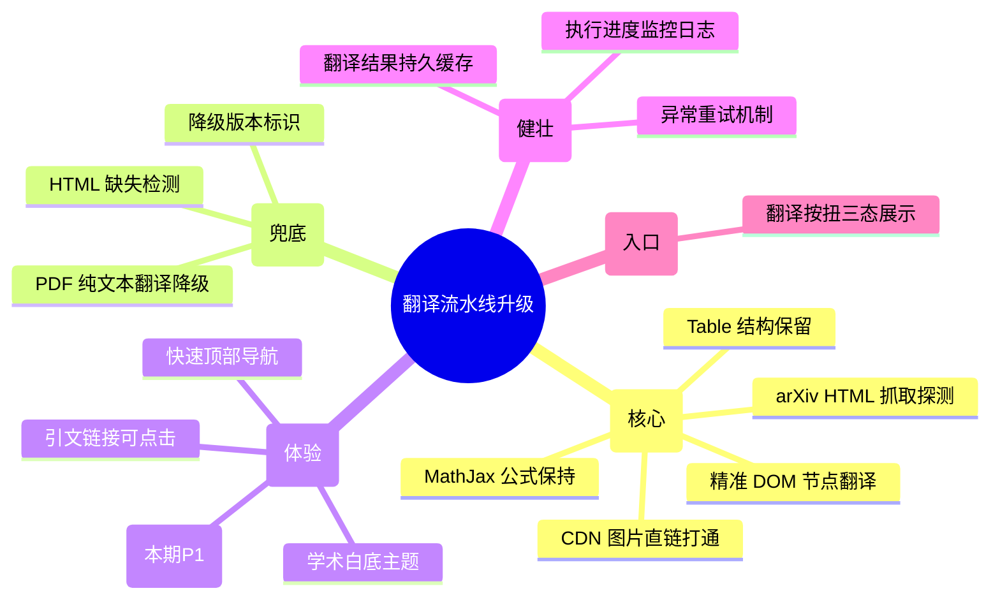
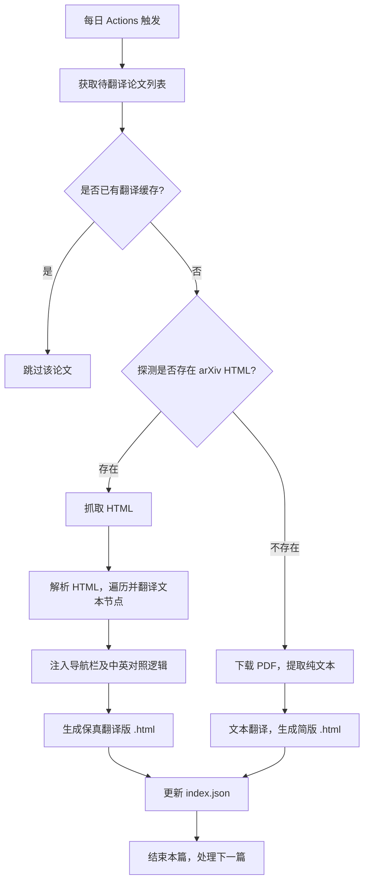
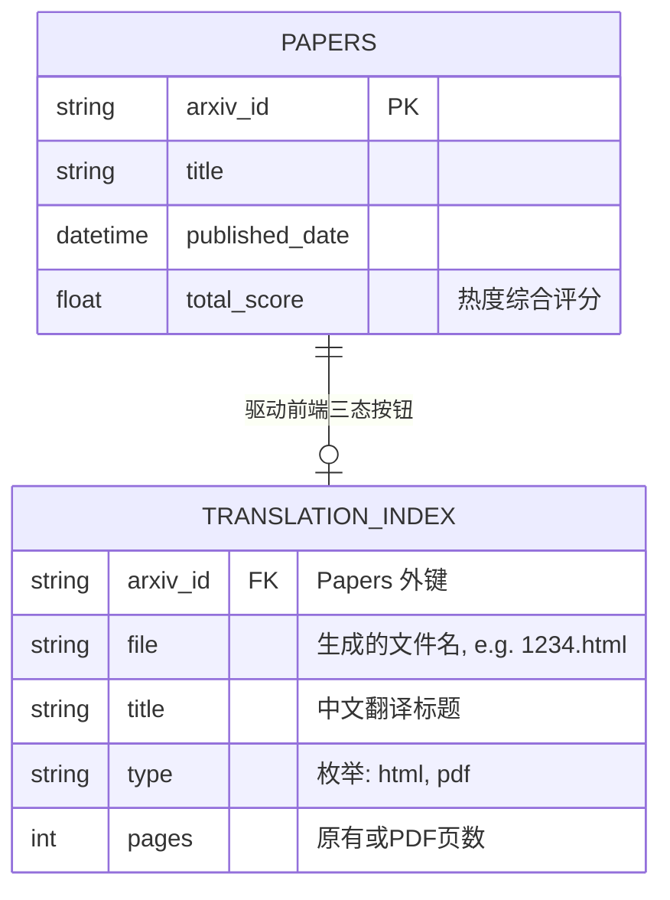

# 翻译流水线升级 PRD (v1.0 - 框架层草案)

## 一、 需求背景

### 1.1 业务现状
当前 AI Paper Tracker 的中文翻译功能采用「PDF 纯文本提取 + Google Translate」的方案。由于现有技术的局限，直接提取 PDF 文本会导致图片、图表、数学公式及原始排版全部丢失，极大影响了用户的阅读体验。一篇深度学习的论文，如果缺少了关键的网络结构图、效果对比表格和损失公式，其可读性将大打折扣。这也导致翻译产出被用户评价为“不能看的东西”。

### 1.2 核心痛点
*   **信息丢失严重**：图片（网络结构、实验结果）、表格（对比数据）、公式（核心理论）在 PDF 纯文本提取过程中完全消失。
*   **排版错乱**：去除图片和表格后，剩余的纯文本段落经常发生拼接错误或断句错误，阅读极其吃力。
*   **阅读体验极差**：难以通过中文翻译版直观快速地理解论文的核心思想，失去了“快读”的意义。

### 1.3 升级目标
*   **保真阅读体验**：升级翻译流水线，确保翻译后的中文 HTML 页面能够**保留原文所有的图片、公式、表格和基本排版**（章节层级等）。
*   **降低阅读门槛**：使国内 AI 研究者只需扫一眼翻译版，就能像看高质量中文博客一样轻松掌握论文精髓。

### 1.4 解决方案简述
放弃直接解析 PDF，改用抓取并在本地构建 arXiv 官方提供的原生 HTML 版本（`arxiv.org/html/{id}`）。采用“精准替换”策略：仅遍历并翻译 HTML 的 Text 节点，跳过包含多媒体、公式、代码块的节点。最后在这个保真的 HTML 骨架上，注入深色模式适配和自定义的顶部返回导航栏。对于没有 HTML 版本的少部分论文，通过现有方案进行 PDF 提取降级翻译，保证基本供给。

---

## 二、 用户与角色

| 角色 | 核心诉求 | 典型使用场景 | 期望产出 |
| :--- | :--- | :--- | :--- |
| **AI 研究者（前台用户）** | 能够快速阅览全中文论文，要求图文并茂，有公式、有排版，体验必须好。 | 每天早上浏览热门论文列表，发现感兴趣的标题后，点击“中文翻译”快速泛读。 | 排版与原文高度一致的中文网页。 |
| **系统自动运维（后台角色）** | 高效、稳定、低成本地完成每日批量翻译任务。 | 每天 GitHub Actions 定时触发。 | 包含新翻译 HTML 和更新后 `index.json` 的自动化提交。 |

### 2.2 用户旅程图 (User Journey)

---

## 三、 功能概述

### 3.1 功能架构树
基于前期沟通，本期重构涉及的功能架构如下：

### 3.2 核心主干流程

### 3.3 状态机分析 (翻译按钮展示态)

前端热榜翻译按钮的状态流转：

| 当前状态 | 触发条件 | 下一状态 | 前端 UI 表现 |
| :--- | :--- | :--- | :--- |
| **初始待检** | `index.json` 请求中 | 判定中 | (按钮 loading 或暂不显示状态) |
| 判定中 | `index.json` 中不存在该 arXiv_ID | **暂无翻译** | 灰色按钮，文案 "暂无翻译"，不可点击 |
| 判定中 | 存在且标识为 HTML 保真版 | **保真翻译可用** | **紫色**按钮，文案 "🔬 保真翻译"，可点击跳转 |
| 判定中 | 存在且标识为 PDF 简版 | **简版翻译可用** | **橙色**按钮，文案 "📝 简版翻译"，可点击跳转 |

### 3.4 核心业务规则

*   **[R01] API 选型及费控**。本期优先采用 `Google Translate`（通过 `deep-translator` 网页端抓取版），无需 API Key 且完全免费。后续如果触发频繁限流影响每日构建，或其他用户群产生高质量付费需求，再考虑切换 `DeepL Pro`。
*   **[R02] HTML 解析白名单**。翻译引擎遍历 DOM 树时，遇到以下标签须**完全跳过其内部内容**的翻译：`<math>` (数学公式), `<script>` (脚本), `<style>` (样式), `<code>` (代码块), `<a>` 标签部分属性(防止链失效), 以及部分带有特定 `class="ltx_Math"` 的元素。
*   **[R03] 全量翻译策略**。每天获取的热榜 Top 50 论文，**全部尝试翻译**。不要因为没有 HTML 就不翻。
*   **[R04] 降级翻译标注**。对于使用 PDF 降级翻译生成的简版，必须在生成的 HTML 顶部醒目位置增加 Alert 提示："*注：本文无 arXiv 原生 HTML 版本，当前为基于 PDF 的简易文本翻译版，可能会丢失图表和排版。*"。

### 3.5 优先级定义

*   **P0 (阻塞发布)**：arXiv HTML 抓取能力、标签精准过滤与文本节点翻译、公式与图片不乱码、降级 PDF 流程畅通。
*   **P1 (核心体验)**：白底主题注入、中 /英对照阅读功能、前端三态按钮区分展示、自动缓存逻辑。

---

## 四、 功能详述（第一部分：前端用户 Web 端）

本章节描述 C 端 AI 研究者在浏览器中看到和交互的界面功能。

### 4.1 每日热榜主页（局部更新）

仅对现有主页上每篇论文卡片的「翻译按钮」进行逻辑和 UI 样式升级。

#### ① 视觉描述
`[原型图 - 翻译按钮三态_待补充]`
*(UI 预期：在原 PDF/arXiv 按钮旁边的长条翻译按钮，根据翻译状态呈现对应的紫色/橙色/灰色主题。)*

#### ② 功能描述
*   **入口**：首页论文卡片操作区。
*   **字段与数据来源**：按钮状态受前端 `usePapers.js` 请求 `index.json` 返回的数据驱动。
*   **交互说明**：
    *   遍历每日列表，从 `index.json` 判断该论文的翻译版本标识：
    *   **状态 A（可用保真版）**：当映射存在且类型为 `html`，按钮高亮（主品牌色紫色），文案为 `🔬 保真翻译`，点击后新标签页打开 `data/translations/{arxiv_id}_html.html`。
    *   **状态 B（可用简版）**：当映射存在且类型为 `pdf`，按钮次级高亮（橙色），文案为 `📝 简版翻译`，点击后新标签页打开 `data/translations/{arxiv_id}.html`。
    *   **状态 C（暂无可读翻译）**：当映射不存在时，按钮灰色禁用，文案 `暂无翻译`，不可点击，Hover 提示：*翻译任务正在处理中或发生异常*。

#### ③ 异常描述
| 异常场景 | 处理方式 | 前端提示 |
| :--- | :--- | :--- |
| `index.json` 请求超时或失败 | 降级处理，所有卡片翻译按钮灰显。 | 无全局阻断弹窗，按钮不可用即可。 |
| 点击可用翻译按钮后 404 | 页面跳转后由 Nginx/GitHub Pages 呈现 404 (理论上通过 index 强绑定极少发生)。 | - |

#### ④ 数据需求
| 事件名称 | 触发时机 | 携带参数 | 业务价值 |
| :--- | :--- | :--- | :--- |
| `click_translate_btn` | 点击状态A或B的翻译按钮时 | `arxiv_id`, `version_type` (html/pdf), `entry` (homepage) | 分析高保真 vs 简版翻译的点击转化率和论文受欢迎程度。 |

---

### 4.2 中文翻译正文阅读页

独立的新标签页面，展示经过流水线处理后的 arXiv HTML（或 PDF 简版）。此处定义最终对用户的表现形态。

#### ① 视觉描述
`[原型图 - 翻译正文阅读页_待补充]`
*(UI 预期：屏幕最顶部有一条高度 48px 的吸顶黑色导航栏（沉浸式），下方全屏为白底学术阅读区，保留所有原始 CSS 布局、图表排版。)*

#### ② 功能描述
*   **全页面视觉基调**：通过注入 `custom_theme.css`，覆盖 arXiv 默认底色，统一为极简全白背景 (`#ffffff`)，文字深灰 (`#333333`)，优化行高便于长文阅读。
*   **顶部导航栏 (注入功能)**：
    *   固定在视窗顶部（`position: fixed`，z-index 最高）。
    *   左侧区域：包含 `< 返回热榜` 按钮，点击关闭当前页或 `history.back()`。
    *   右侧区域：包含 `🔗 arXiv 原文` (跳往官方 html/abs 页)、`📥 PDF 下载`。
    *   **中英对照切换 Switch**：核心交互。默认为 `中文模式`。
        *   开启 `中英对照模式` 时：通过注入的 JavaScript 逻辑，遍历带有翻译映射属性的双语节点。原文（通过 `data-original-text` 等隐藏属性保存的内容）将以浅灰色、略小字号紧贴显示在对应的中译文下方或上方（具体的 DOM 操作方式由开发确认）。
*   **正文阅读区 (引擎处理结果直接呈现)**：
    *   **图表交互**：完全保留 arXiv 原始图片的点击放大或新窗口打开体验，图片不被破坏；Table 可原生横向滚动（如有）。
    *   **数学公式**：依托 MathJax 继续发挥作用，所有内联和独立公式原样显示，无乱码。
    *   **交叉引用**：页面内部的注脚链接、图片引用链接 `[1]`, `(Fig. 2)` 完全可用，点击锚点平滑滚动。
    *   **降级声明（条件显示）**：如果当前渲染的是 PDF 降级版本，页面最顶端会在导航栏下方插入一个醒目的黄色 Alert 提示框，包含文案：*“注：本文无 HTML 版本，当前为基于 PDF提取的纯文本翻译版，可能会丢失部分图表和排版。”* `[详见规则 R04]`

#### ③ 异常描述
| 异常场景 | 处理方式 | 前端提示 |
| :--- | :--- | :--- |
| 论文图片被墙 / 无法加载 | 依赖 arXiv 原生 CDN 稳定性，如加载失败展示系统自带破图图标即可。 | 无额外提示。 |
| MathJax 渲染超时或失败 | 此时公式可能短暂显示为 LaTeX 源码。等待网络恢复刷新。 | 无特殊处理。 |

#### ④ 数据需求
| 事件名称 | 触发时机 | 携带参数 | 业务价值 |
| :--- | :--- | :--- | :--- |
| `toggle_bilingual_mode` | 点击顶部“中/英对照切换”开关时触发 | `arxiv_id`, `state` (on/off) | 了解用户对于对照阅读的粘性，为后续是否深化该功能做评估。 |

---

### 4.3 每日批量翻译任务（后端系统/CI 端）

本章节描述系统后台自动化执行的核心翻译调度流水线（无可视 UI）。

#### ① 视觉描述
*(无图形界面。UI 表现为 GitHub Actions 的命令行输出日志。)*

#### ② 功能描述
*   **入口**：GitHub Actions 定时触发（或手动 dispatch），入口文件 `translate_papers.py`。
*   **输入字段**：今日热榜前 50 篇论文的 `arxiv_id` 集合。
*   **交互（执行）说明**：
    *   **步骤 1 (探测可用性)**：遍历每一个 `arxiv_id`，请求 `https://arxiv.org/html/{arxiv_id}v1` 探测是否存在 HTML 原生版本。
    *   **步骤 2a (HTML 保真分支 - 优先)**：如果存在，下载原始 HTML，解析 DOM 树，遍历 `
`, `<h1>`~`<h6>`, `<li>`, `<tr>`, `<td>`, `<caption>`, `` 等纯文本容器。针对满足条件的节点，提取其中文本。
    *   **步骤 2b (节点跳过与保留)**：遇到 `<math>` 和具有 `class="ltx_Math"` 的元素，完全不解析不翻译；遇到 `` 和 `<table>` 保留原始 HTML 结构。`[详见规则 R02]`
    *   **步骤 3 (翻译调用)**：由于单篇论文可能长达几万字符，将提取的文本数组切分成小于 4900 字符的 chunks，串行调用 Google Translate (通过 `deep-translator`)，失败自动重试最多 3 次。`[详见规则 R01]`
    *   **步骤 4 (双语组装与写回)**：获取翻译包后，将译文写回 DOM。同时将原文作为隐藏属性赋予该 DOM 节点，或采用特定的包装标签（供前端中英对照功能使用）。
    *   **步骤 5 (导航/CSS 注入)**：在 `<body>` 顶部插入包含返回链接、中英开关的导航栏 HTML 字符串；在 `<head>` 注入白底基础排版 CSS（`custom_theme.css`）。
    *   **步骤 6 (降级分支)**：如果步骤 1 探测不到 HTML，调用 `pdf_extractor` 下载 PDF 并转换为纯文本 HTML 骨架进行翻译。顶部注入降级 Alert。`[详见规则 R04]`
    *   **步骤 7 (索引更新)**：单篇完成后保存文件，更新 `index.json` 中的 `type` (html/pdf) 和 `status`。

#### ③ 异常描述
| 异常场景 | 处理方式 | 监控/告警 |
| :--- | :--- | :--- |
| 请求 arXiv HTML 超时或被封锁 IP | 单篇失败跳过；如果是大面积 (连续 5 篇报错)，终止 Actions 并报错。 | Actions 失败邮件通知。 |
| Google Translate 接口限流 (HTTP 429) | `time.sleep(10)` 指数退避重试，3 次后放弃当前论文，继续下一篇。 | CI Logs 输出 Warning 信息。 |
| DOM 结构畸形导致解析崩溃 | Except 捕获，当前论文标记为失败，不阻塞流水线。 | CI Logs 输出 Error 堆栈。 |

#### ④ 数据需求
*(此端为系统日志，不产生埋点事件，输出为结构化本地 Log。)*
| 日志字段 | 生成阶段 | 记录信息 | 业务价值 |
| :--- | :--- | :--- | :--- |
| `translation_task_finish` | 每篇论文翻译结束 | `arxiv_id`, `type` (html/pdf/skipped), `time_cost_seconds`, `char_count` | 监控翻译引擎耗时，评估后续是否需要切换大并发商业 API。 |

---

## 五、 数据模型

由于本项目是基于 GitHub Actions + 静态站点的无数据库架构，此处主要规范持久化到 JSON 文件的数据契约。

### 5.1 核心数据与状态机联动

*   `data/translations/index.json` 作为唯一的事实表，其内容以 `arxiv_id` 为 Key，由后台 Actions 执行完毕后全覆盖写入。
*   **前端取回该文件后判断**：只要 `dict[arxiv_id]` 存在，按钮即亮起。`dict[arxiv_id].type == 'html'` 时判定为 "保真版"，`type == 'pdf'` 为 "简版"。 

---

## 六、 非功能需求

### 6.1 性能与可用性
*   **翻译耗时**：每篇数万字的保真翻译目标耗时需控制在 15-30 秒内（采用 chunk 分段加速及缓存）。Top 50 整体翻译任务不得超过 GitHub Actions 的 6 小时超时限制。
*   **断点与缓存**：Actions 运行时，如果某文章已翻译 (`data/translations/{id}_html.html` 存在)、且源 HTML 无新版，必须跳过以节省接口调用和时间。

### 6.2 兼容性与渲染
*   **前端浏览器支持**：新版中文翻译阅读页需支持主流 Chrome/Edge/Firefox 最新版。考虑到原始 arXiv HTML 的兼容性要求，移动端同样只需自适应（不做特殊缩小化，允许双指缩放）。
*   **MathJax 公式**：前端插入时必须继承或动态加载 arXiv 官方 CDN 的 MathJax 版本（v3+），防止公式无法解析。

### 6.3 成本与合规
*   **零成本运营**：强要求后端持续使用免费版 Google Translate 进行 DOM 替换翻译，不对外部商业 API 产生账单。
*   **内容合规**：原封不动保留原作者的版权声明、作者栏等信息；不得修改参考文献及引用来源；必须保留返回 arXiv 原文的明显入口。

### 6.4 安全与权限声明
*   **鉴权矩阵不适用**：本项目为一个定位于辅助科研工作者的纯开源静态工具。全链路前端资源托管于 GitHub Pages，无需登录，无鉴权机制。
*   **数据安全不适用**：后端自动化生成的数据不包含任何隐私数据（均为公开学术论文），不涉及横向/纵向越权及并发写入冲突等问题。

---

## 七、 里程碑规划

| 阶段 | 核心目标 | 预计排期 |
| :--- | :--- | :--- |
| **M1: 引擎适配与联调** | 跑通 arXiv HTML 抓取，完成跳过机制及翻译回填，输出本地有效 HTML。 | T0 |
| **M2: 端到端与交互** | 前端主题 CSS 注入、顶部导航完成、`usePapers.js` 解析对接三态按钮。 | T0+1 |
| **M3: 自动流水线跑通** | GitHub Actions 每日重构闭环成功，覆盖全量异常重试。中英对照开关。 | T0+2 |

---

## 八、 遗留问题

1.  如果在后续版本有大量用户抱怨 Google Translate 学术用词不严谨，需评估提供 DeepL 切换入口（但需考量成本开销，可能仅面向赞助者或自定义 APIKey 的用户开放）。
2.  arXiv 的原生 HTML 本身是在逐步推广期，部分极老的论文及小众格式不会有 HTML。本 PRD 的重点在未来的高质量论文消费体验上。兜底的 PDF 纯文本提取质量短期内不再投入优化精力。

---
*自检日志记录：已完成结构完整性、工程落地性（明确前端参数、缓存规避、防超时），满足相关非功能边界约束。*
