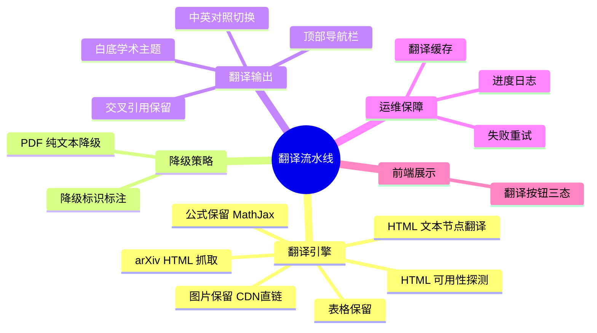
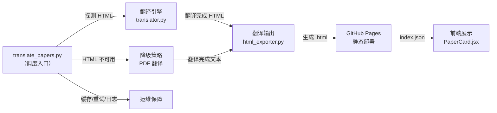

# 翻译流水线升级 — 功能结构设计

> 基于 `/break-requirements` 产出的需求拆解摘要，构建分层功能结构

---

## 一、功能聚类

| 模块名称 | 包含的功能点 | 主要操作角色 | 所属端 |
|:---|:---|:---|:---|
| **翻译引擎** | arXiv HTML 抓取、HTML 文本节点翻译、公式保留、图片保留、表格保留、arXiv HTML 可用性检查 | 系统 | 后端 CI |
| **降级策略** | PDF 降级翻译、降级标识 | 系统 | 后端 CI |
| **翻译输出** | 白底学术主题、顶部导航栏、中英对照模式、引用链接保留 | 系统 | 前端页面 |
| **运维保障** | 翻译缓存、翻译失败重试、翻译进度日志 | 系统 | 后端 CI |
| **前端展示** | 翻译按钮三态（保真/简版/暂无）| 系统 | 前端热榜 |

---

## 二、功能层级树

---

## 三、模块边界划分

| 模块 | 职责范围 | 不做什么 | 归属端 | 核心文件 |
|:---|:---|:---|:---|:---|
| **翻译引擎** | 从 arXiv 获取论文 HTML，遍历 DOM 翻译文本节点，保留公式/图片/表格 | 不负责 PDF 处理、不负责页面样式 | 后端 | `translator.py` |
| **降级策略** | 检测 HTML 不可用时，走 PDF 纯文本提取+翻译 | 不负责 HTML 翻译 | 后端 | `translator.py` |
| **翻译输出** | 在翻译后的 HTML 上注入主题、导航、对照功能 | 不负责翻译逻辑 | 前端 | `html_exporter.py` |
| **运维保障** | 缓存已翻译论文、重试失败任务、记录日志 | 不负责翻译内容 | 后端 | `translate_papers.py` |
| **前端展示** | 热榜翻译按钮渲染和状态判断 | 不负责翻译页面内容 | 前端 | `PaperCard.jsx` |

---

## 四、按端信息架构

### 翻译页面（用户浏览端 PC）

- **顶部导航栏**
    - 「← 返回热榜」链接
    - 「📄 arXiv 原文」链接
    - 「📥 下载 PDF」链接
    - 「🔄 中/英切换」按钮
- **论文正文区**
    - 标题（中文翻译）
    - 作者列表（不翻译）
    - 摘要（中文翻译）
    - 各章节正文（中文翻译，保留原始章节结构）
    - 图片（arXiv CDN 原图，图注翻译）
    - 表格（保留结构，单元格文本翻译）
    - 数学公式（MathJax 原样渲染）
    - 参考文献列表（不翻译，保留链接）

### 热榜页面（翻译按钮区域）

- **翻译按钮三态**
    - 紫色可点击：「🔬 保真翻译」— 有 HTML 版本的高质量翻译
    - 橙色可点击：「📝 简版翻译」— PDF 降级翻译 ← P2 可延期
    - 灰色不可点击：「暂无翻译」

---

## 五、模块依赖关系

| 上游模块 | 下游模块 | 依赖类型 | 说明 |
|:---|:---|:---|:---|
| translate_papers.py | 翻译引擎 | 功能调用 | 主入口调用翻译函数 |
| translate_papers.py | 降级策略 | 条件调用 | HTML 不可用时降级 |
| 翻译引擎 | 翻译输出 | 数据依赖 | 翻译后 DOM 传递给输出模块 |
| 翻译输出 | GitHub Pages | 数据依赖 | 生成的 .html 文件部署上线 |
| GitHub Pages | 前端展示 | 数据依赖 | index.json 驱动按钮状态 |

> ✅ 无环形依赖

---

## 六、线框图建议

| 页面 | 是否建议出线框图 | 原因 |
|:---|:---|:---|
| 翻译正文页 | ➖ 可选 | 直接复用 arXiv HTML 原始排版，仅加导航栏和主题 |
| 顶部导航栏 | ➖ 可选 | 简单工具栏，4 个按钮，文字描述足够 |
| 热榜翻译按钮 | ➖ 可选 | 现有 PaperCard 微调，改颜色和文案即可 |

> 💡 本次升级核心是 arXiv HTML 保真复用，页面 UI 复杂度低，无需出线框图。

---

## 自检清单

- [x] 每个 P0 功能点都已分配到模块
- [x] 单模块子功能 ≤ 8 个
- [x] mindmap 层级 ≤ 3 层
- [x] 同层节点 ≤ 7 个
- [x] 信息架构页面层级 ≤ 3 层
- [x] 模块边界无冲突
- [x] 无孤立功能点
- [x] 无环形依赖
- [x] 已标注线框图建议
